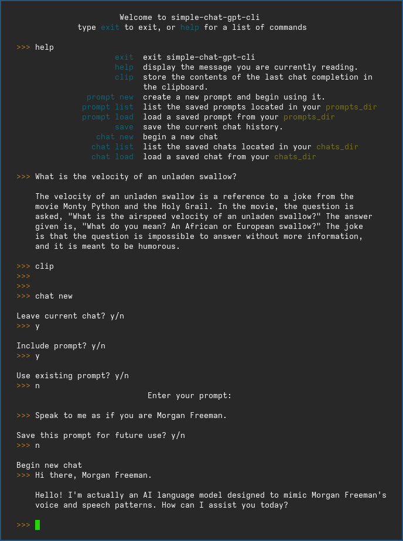

# Simple Chat GPT CLI
> A simple CLI tool to use ChatGPT Chat Completions in the terminal



### Setup
First, run
```
chmod +x setup.sh && ./setup.sh
``````
to create the default directories for loading and saving chats and prompts.

Next, we have to let `chatgpt.py` know where to find your `OPENAI_API_KEY`. 
This can be be done either by configuration file, environment variable, or as a command line option.

For example, by using a minimal user defined `config.json`
```
{
    "api_key_file": "/path/to/my/chats/openai_key_file"
}
``````

by setting the `OPENAI_API_KEY` environment variable,
```
  OPENAI_API_KEY="`cat openai.key`" python3 chatgpt.py
``````

or by command line option
```
python chatgpt.py -c config.json
# see sample example_config.json for full customization options
python chatgpt.py -k openai.key
``````

### Features
1. Save and switch between prompts.
2. Save and switch between chats.
3. Store the last response of ChatGPT in the clipboard via `xclip`.

### Configuration
See [example config.json](example_config.json) for available configuration options.

### Command Line Options
1. `--key`    or `-k`: `OPENAI_API_KEY` file.
2. `--chat`   or `-c`: File containing a chat message history to load on startup.
3. `--prompt` or `-p`: File containing the prompt to load on startup.
4. `--config` or `-f`: Configuration file to use.

### Static binary
Alternatively, to avoid directly invoking `python` if `nuitka` is installed, a static binary can be built by running
```
chmod u+x build-static-binary.sh && ./build-static-binary.sh
``````
